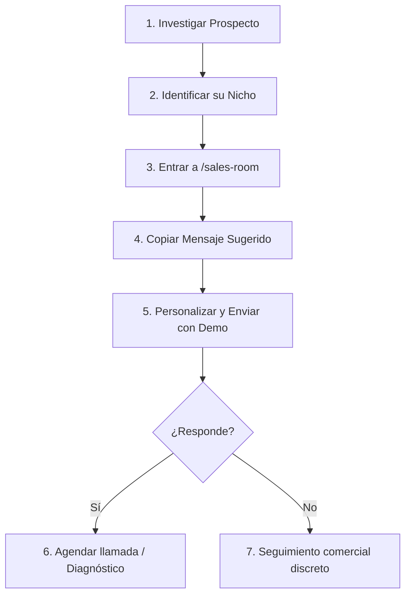

# Luma Premium Sales Room - Playbook Comercial

Este documento detalla el propósito de la **Sales Room** (`/sales-room`) y define los protocolos para que **Marcos** y **William** utilicen esta herramienta interactiva para maximizar las tasas de cierre y prospección de servicios digitales de Luma Premium.

---

## 1. Objetivo del Sales Room

La **Sales Room** no es un portal para el cliente final; es una **herramienta interna de habilitación de ventas**. Su objetivo es simplificar el flujo comercial de prospección y negociación de Luma Premium al centralizar:

1.  **Filtro por Nicho**: Identificar rápidamente el dolor comercial exacto de cada tipo de cliente.
2.  **Mapeo de Solución**: Conectar el dolor del cliente con el producto Luma exacto.
3.  **Demos Funcionales**: Acceder con un solo clic a las demos interactivas listas para compartir en frío o mostrar en vivo.
4.  **Mensajes de Captación**: Mensajes optimizados listos para ser copiados y personalizados para enviar por WhatsApp o LinkedIn.
5.  **Script de Llamada (Qué Decir / Qué NO Prometer)**: Indicaciones estratégicas para evitar falsas expectativas y enfocar la venta en el retorno de inversión (ROI).

---

## 2. Guía Operativa para William

William debe seguir este protocolo estructurado para prospectar y calificar clientes:

### Paso 1: Selección de Demo según Cliente
Antes de contactar al cliente, William debe identificar en qué categoría encaja su negocio en el menú de la Sales Room. Al hacer clic sobre el nicho correspondiente, se desplegarán las demos específicas para ese mercado:
*   **Inmobiliarias / Real Estate**: Usar *Luma Estate OS* (catálogo dinámico) o *Vista del Río* (experiencia de desarrollo premium).
*   **Comercio**: Usar *Luma Commerce OS* para mostrar el flujo de carrito y conexión con CRM.
*   **Spas o Consultorios**: Usar *Santuario Estética* o *Santuario Concierge* (agendamiento interactivo por IA).
*   **Servicios/Marcas Personales**: Usar *Marcos Portfolio* como estándar de autoridad visual.

### Paso 2: Envío del Mensaje Sugerido
1.  Haz clic en el botón **"Copiar Mensaje"**.
2.  Pega el texto en el chat con el prospecto (WhatsApp, Instagram DM, LinkedIn).
3.  **Muy Importante**: Reemplaza las etiquetas entre corchetes (por ejemplo, `[Nombre]` o `[Nombre Inmobiliaria]`) con los datos reales del prospecto antes de enviar.

---

## 3. Protocolo de Precios y Negociación

Para evitar el descarte inmediato por precio o malentendidos sobre el presupuesto, se deben seguir estas pautas estrictas:

*   **Página Pública de Soluciones (`/soluciones`)**: Utiliza términos amplios como "Desde $X USD" o "Según alcance de la infraestructura". Sirve para que el cliente entienda que se trata de soluciones profesionales de alta gama, autocalificando su presupuesto.
*   **Manejo de Objeciones de Precio**: Si el prospecto dice que el precio es elevado, William debe enfocar la conversación en:
    1.  **Fugas de Leads**: "¿Cuánto dinero estás perdiendo hoy al tardar más de 30 minutos en atender por WhatsApp?"
    2.  **Tiempo del Personal**: "El Concierge IA hace el trabajo de calificación de una secretaria 24/7 sin ausencias."
    3.  **Autoridad**: "Una web premium te permite aumentar el valor de tus servicios frente a tu competencia."

---

## 4. Gestión de Expectativas: Qué NO Prometer

Para asegurar una entrega sin fricciones técnicas, William **nunca** debe prometer lo siguiente:

| Nicho Comercial | Lo que SÍ se promete | Lo que **NUNCA** se debe prometer |
| :--- | :--- | :--- |
| **Real Estate** | Interfaz rápida, catálogo interactivo con filtros inmediatos y captación fluida. | Integración con sistemas CRM locales obsoletos o cerrados sin cotizar una API a medida. |
| **Commerce** | Carrito de compras veloz, recuperación de carritos abandonados y conexión al CRM. | Automatización de inventario físico o sincronización con POS de tienda física sin consultar primero a Marcos. |
| **Belleza / Spa** | Agendamiento inteligente conectado a Google Calendar y recordatorios automáticos. | Respuestas de la IA a diagnósticos de salud delicados o tratamientos estéticos complejos no configurados. |
| **WhatsApp / Chats** | Respuestas inmediatas, calificación básica del lead y paso al vendedor en caliente. | Uso de APIs no oficiales o envíos masivos de spam que puedan provocar el baneo del número de WhatsApp. |

---

## 5. El Embudo de Conversión: De Diagnóstico a Propuesta

El proceso comercial de Luma Premium se divide en tres fases claras:

1.  **Fase 1: El Diagnóstico Digital (Gancho Comercial)**
    *   *Objetivo*: Generar curiosidad y valor inmediato de forma gratuita o cortesía comercial.
    *   *Acción*: Analizar su velocidad móvil, SEO básico y píxeles mediante el **Luma Intelligence Hub** actual.
2.  **Fase 2: Presentación de Oportunidades**
    *   *Objetivo*: Mostrar las "fugas" de su sitio web actual.
    *   *Acción*: Guiar al cliente en una llamada rápida mostrando la demo correspondiente de la **Sales Room** para que visualicen cómo debería funcionar su negocio.
3.  **Fase 3: Propuesta Cerrada**
    *   *Objetivo*: Firma del acuerdo y pago inicial.
    *   *Acción*: Enviar una cotización a medida detallando cuál de nuestras 7 líneas de producto se implementará y los plazos de entrega.
